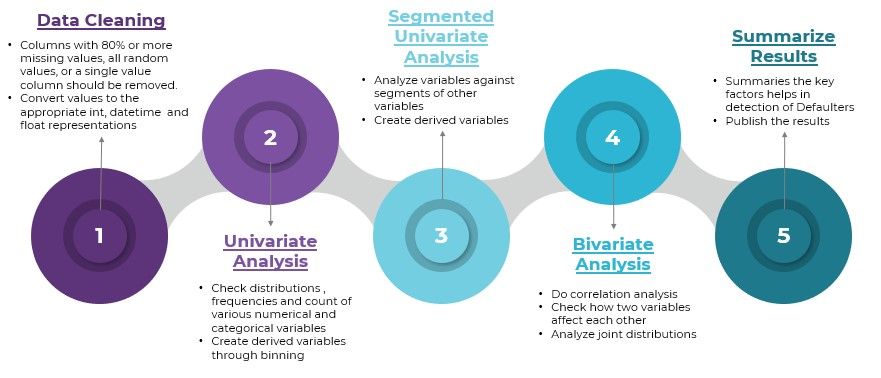

# Lending Club Case Study
> 
Lending club is the largest online loan marketplace, facilitating personal loans, business loans, and financing of medical procedures. Borrowers can easily access lower interest rate loans through a fast online interface. . Like most other lending companies, lending loans to ‘risky’ applicants is the largest source of financial loss (called credit loss). The credit loss is the amount of money lost by the lender when the borrower refuses to pay or runs away with the money owed. In other words, borrowers who default cause the largest amount of loss to the lenders. In this case, the customers labelled as 'charged-off' are the 'defaulters'.

If one is able to identify these risky loan applicants, then such loans can be reduced thereby cutting down the amount of credit loss. Identification of such applicants using EDA is the aim of this case study.

Lending club wants to understand the driving factors (or driver variables) behind loan default, i.e. the variables which are strong indicators of default. It can utilise this knowledge for its portfolio and risk assessment.

## Table of Contents
* [General Info](#general-information)
* [Technologies Used](#technologies-used)
* [Conclusions](#conclusions)
* [Acknowledgements](#acknowledgements)

## General Information

- Lending club wants to understand the driving factors (or driver variables) behind loan default, i.e. the variables which are strong indicators of default. 

- The case study focuses on EDA mainly, to understand the parameters that help us detect the loan defaulters 

- Lending club can utilise this knowledge for its portfolio and risk assessment. 

## Analytical Approach

## Conclusions

- Grades and Sub-Grade are one of the good metrics for finding loan defaulters. Lending club has to look into the information from borrowers before issuing loans to low grade like grade F & G.

- Lending club should reduce the high interest rate for 60 months tenure, there are more chances for loan to get default.

- Lending Club before approving loan should take a look at the DTI (Debt to Income ratio) of the applicants. As DTI of borrowers increases their tendency of defaults also increases.

- Lending club should be more conscious when approving loans for applicants in the lower annual income segment, borrowers having annual income in range of 4k-50k has more of defaults.

- When the loan amount higher the chance of applicants is defaulters. Lending club should properly analyze the applicants demanding higher loan.

- Lending club should be more cautious when approving loan for the purpose of Small business, Debt consolidation ,Credit card and Education.

- Loans having higher interest rate have more defaulters. Lending Club  should check the background of applicant thoroughly if interest rate is high.

- Lending Club should take extra security while approving applicants belonging to NE, NV, SD and AK state, as tendency to default is high.

- If applicant employment length is >10 years Lending Club should thoroughly check applicants background as there are many defaulters in >10 years as an employment length.

## Technologies Used
- Pandas - version 1.1.5
- Numpy - version 1.19.5
- Matplotlib - version 3.3.4
- Seaborn -  version 0.11.0

## Acknowledgements
Contributors 
- Anshul Khadse

## Contact
Created by @MDVRP - feel free to contact me!
